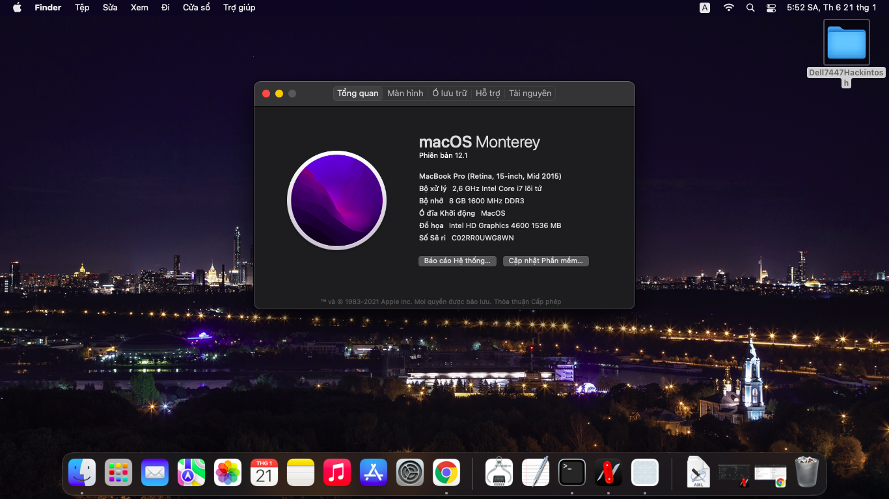

# Dell 7447 Hackintosh
EFI and Instruction to install hackintosh on Dell 7447
**I make this EFI to MacOS Monterey 12.1, you can try it with older version anyway**

## Which package should i use?
For first time installing you should use Debug package which enable verbose for better debugging. Or you can use Release package anyway if there is no issue. The Release package without verbose and log will have better experience on UI and boot speed.

### My Specs:

 - I7 4720HQ
 - 4 GB Memory x2
 - HD4600 + GTX 850M
 - SATA 256 GB SSD + 1 TB HHD (on caddy bay)
 - Sysnaptic Touchpad
 - RTL 8111 + Intel Wireless 3160
 - Audio ALC255
### What is working?
- Wifi + Ethernet
- Bluetooth
- Audio (External, not tested built-in speaker because mine is broken)
- Webcam
- Touchpad / USB Mouse / Keyboard
- Temperature, fan sensor
- Brightness Control (except Brightness Key)
- Sleep
- Power Management
- File Vault
- USB mapped
- Everything except not mentioning
### What's not working?
- dGPU disabled
- SD Card Reader
- Battery not tested because my is broken
- Brightness key F11 F12: You can use Fn+S, Fn+B instead
- DRM (Hardware Acceleration Video using in Apple TV, NetFlix,...)
- iMessage, FaceTime: You have to do it yourself, it also depends on the your account, follow this guide https://dortania.github.io/OpenCore-Post-Install/universal/iservices.html, **you should do it before booting into the MacOS first time if you don't want to do a lot stuff to reset your iServices**

## Instruction

 1. Follow the instruction here https://dortania.github.io/OpenCore-Install-Guide/installer-guide/ to create the USB Installer
 2. Extract the package you have download and put that EFI Folder to the USB, then you should have your USB like this 
 3. Now you can boot your USB Installer, keep in mind that you should resize your partitions to have a free space partition to install before booting to install.
I usually use [Minitool Partiton Wizard](https://www.partitionwizard.com/free-partition-manager.html) to do this. Delete the Microsoft Reversed Partition and even resize Windows partition to have an EFI partition larger than 200MB, than resize or delete a partition you want to get free space for MacOS.
4. Follow the guide here to boot into your USB and start the installation https://dortania.github.io/OpenCore-Install-Guide/installation/installation-process.html#double-checking-your-work. You should use Disk Utility to format the free space you make before as APFS, than run the Installer.
Your laptop will restart several times during installation, each time it restart you will have to press f12 to boot into the usb and choose the install partition. You will have to wait a bunch of time when it say "one minute remaining" on the black screen with apple logo. In my case, it's up to 1.5 hours.
5. If the Installation success and there aren't any issues after that you can copy the EFI folder to your drive's EFI partition to boot MacOS without USB.
Follow this guide https://dortania.github.io/OpenCore-Post-Install/universal/oc2hdd.html, you can replace the old Bootx64.efi but don't lose the Microsoft folder in the EFI partition or you won't be able to boot into Windows.
If the BIOS doesn't regconize OpenCore, you can go to BIOS Setup and Add boot option, navigate to /EFI/BOOT/BOOTx64.efi and save.
You can also set LauncherOption=Full with this guide https://dortania.github.io/OpenCore-Post-Install/multiboot/bootstrap.html to launch OpenCore from your BIOS firmware directly to prevent issues if Windows or Linux try to overwrite the BOOTx64.efi.

### Contribute
If you have issue or have anything better to optimize this EFI, you can open issue so I can fix it after.
